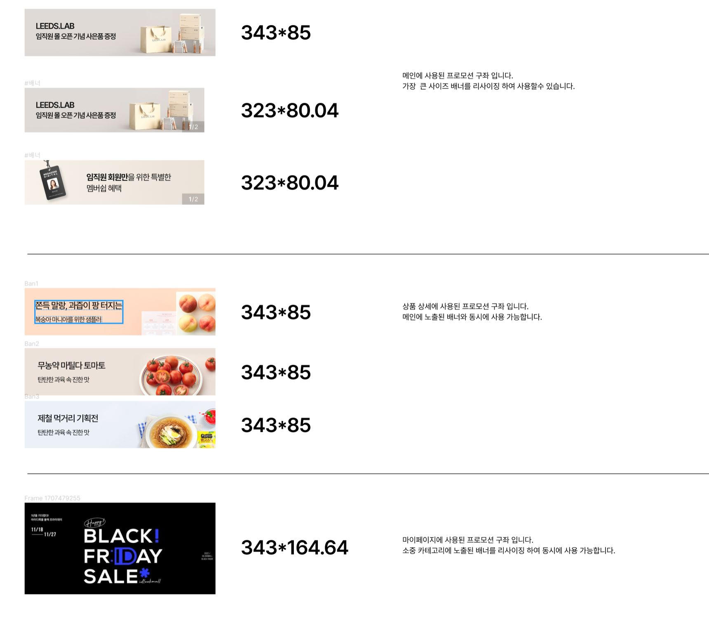

This documents describe banner styles. The buttons is extended from **Swiper** components from swipe collection.
You can read more about it [here](https://swiperjs.com/)

**Table of Contents**

[TOC]

## Banner Carousel (WelfareCarouselMultipleBanner)


The CSS class was written in file **\_welfare-banner-carousel.scss**. The Vue component is **WelfareCarouselMultipleBanner**.
You can see detail more in file **BannerView**.

```html
<WelfareCarouselMultipleBanner />
```

#### Props

Defines valid properties in **WelfareCarouselMultipleBanner** component.
Name | Type | Description
------------- | ------------- | -------------
images | string[] | Array of images

## Banner Image (WelfareBannerImage)



The CSS class was written in file **\_welfare-home-banner-img**. The Vue component is **WelfareBannerImage**.
You can see detail more in file **BannerView**.

```html
<WelfareBannerImage :images="[ImgBanner]" />
```

#### Props

Defines valid properties in **WelfareBannerImage** component.

| Name              | Type    | Description                          |
| ----------------- | ------- | ------------------------------------ |
| images            | any[]   | The list of images                   |
| hideAmount        | boolean | Mark hide number of images           |
| hideControlMedia  | boolean | Mark hide next/previous button       |
| classMediaControl | string  | Style class of media control button. |
| spaceBetWeen      | number  | The distance between each image item |
| allowSlideNext    | boolean | Allow next slide image               |
| allowSlidePrev    | boolean | Allow previous slide image           |
