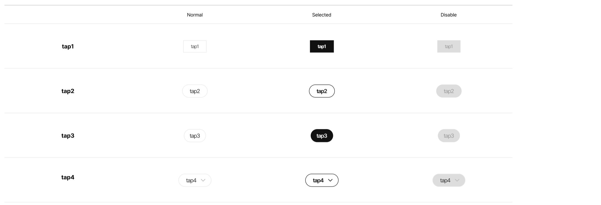
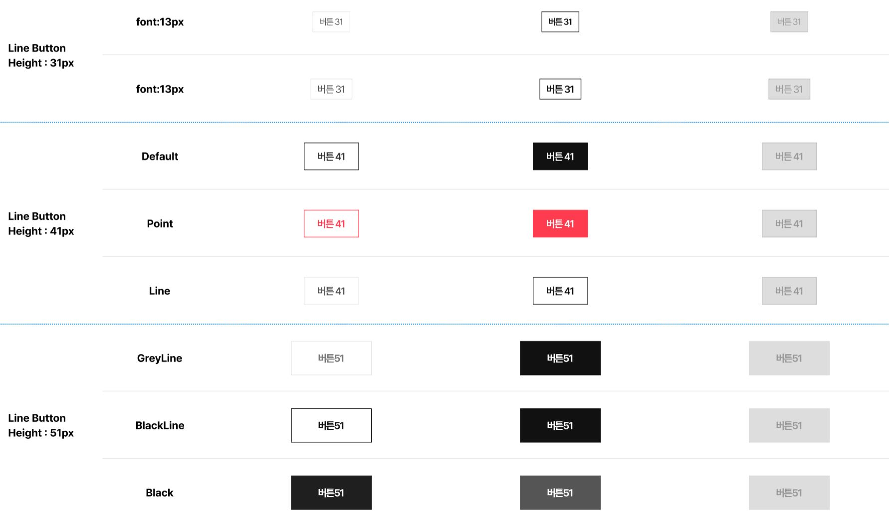
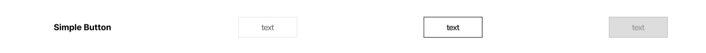
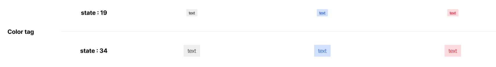
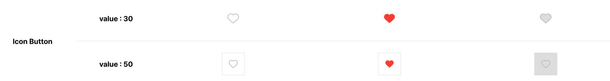

This documents describe button styles. The buttons is extended from **Button** components from PrimeVue UI-Kit collection.
You can read more about it [here](https://primevue.org/button/)

**Table of Contents**

[TOC]

## Button Tap (WelfareButtonTap)


The CSS class was written in file **\_welfare-button-tap.scss**. The Vue component is **WelfareButtonTap**.
You can see detail more in file **ButtonView**.

```html
<WelfareButtonTap text="tap1" />
<WelfareButtonTap :active="true" text="tap1" />
<WelfareButtonTap disabled text="tap1" />
```

#### Props

Defines valid properties in **WelfareButtonTap** component.

| Name       | Type                                                    | Description                    |
| ---------- | ------------------------------------------------------- | ------------------------------ |
| text       | string                                                  | Text of the button.            |
| disabled   | boolean                                                 | Mark button in disabled state  |
| active     | boolean                                                 | Mark button is selected or not |
| class      | any                                                     | Style class of the button.     |
| typeAction | "submit", "reset", "button"                             | The type of button.            |
| type       | "tapSquare", "tapRound", "tapCircle" , "tapCircleArrow" | The button's type style        |

#### Emits

Defines valid emits in **WelfareButtonTap** component.

| Name  | Parameters | ReturnType | Description                |
| ----- | ---------- | ---------- | -------------------------- |
| click |            | void       | The click event of button. |

## Button Line (WelfareButtonLine)


The CSS class was written in file **\_welfare-button-line.scss**. The Vue component is **WelfareButtonLine**.
You can see detail more in file **ButtonView**.

```html
<WelfareButtonLine type="sm" text="버튼 31" />
<WelfareButtonLine type="md" text="버튼 41" />
<WelfareButtonLine lg-state="grey-line" type="lg" text="버튼51" />
<WelfareButtonLine type="lg" text="버튼51" />
```

#### Props

Defines valid properties in **WelfareButtonLine** component.

| Name       | Type                                 | Description                               |
| ---------- | ------------------------------------ | ----------------------------------------- |
| text       | string                               | Text of the button.                       |
| disabled   | boolean                              | Mark button in disabled state             |
| active     | boolean                              | Mark button is selected or not            |
| class      | any                                  | Style class of the button.                |
| typeAction | "submit", "reset", "button"          | The type of button.                       |
| type       | "sm", "md", "lg"                     | The button's type style                   |
| smSate     | boolean                              | Mark button in small style                |
| mdState    | "default", "point", "line"           | The type style when button has size is md |
| lgState    | "grey-line", "black-line", "default" | The type style when button has size is lg |

#### Emits

Defines valid emits in **WelfareButtonLine** component.

| Name  | Parameters | ReturnType | Description                |
| ----- | ---------- | ---------- | -------------------------- |
| click |            | void       | The click event of button. |

## Button Full (WelfareButtonFull)


The CSS class was written in file **\_welfare-button-full.scss**. The Vue component is **WelfareButtonFull**.
You can see detail more in file **ButtonView**.

```html
<WelfareButtonFull class="wf_width-271" text="더보기 51" />
<WelfareButtonFull class="wf_width-271" :active="true" text="더보기 51" />
<WelfareButtonFull class="wf_width-271" disabled text="더보기 51" />
```

#### Props

Defines valid properties in **WelfareButtonFull** component.

| Name       | Type                        | Description                               |
| ---------- | --------------------------- | ----------------------------------------- |
| text       | string                      | Text of the button.                       |
| disabled   | boolean                     | Mark button in disabled state             |
| active     | boolean                     | Mark button is selected or not            |
| class      | any                         | Style class of the button.                |
| typeAction | "submit", "reset", "button" | The type of button.                       |
| isRotate   | boolean                     | the status of arrow icon is expand or not |

#### Emits

Defines valid emits in **WelfareButtonFull** component.

| Name  | Parameters | ReturnType | Description                |
| ----- | ---------- | ---------- | -------------------------- |
| click |            | void       | The click event of button. |

## Button Simple (WelfareButtonSimple)


The Vue component is **WelfareButtonSimple**.You can see detail more in file **ButtonView**.

```html
<WelfareButtonSimple text="text" />
<WelfareButtonSimple active text="text" />
<WelfareButtonSimple disabled text="text" />
```

#### Props

Defines valid properties in **WelfareButtonSimple** component.

| Name       | Type                        | Description                    |
| ---------- | --------------------------- | ------------------------------ |
| text       | string                      | Text of the button.            |
| disabled   | boolean                     | Mark button in disabled state  |
| active     | boolean                     | Mark button is selected or not |
| class      | any                         | Style class of the button.     |
| typeAction | "submit", "reset", "button" | The type of button.            |

#### Emits

Defines valid emits in **WelfareButtonSimple** component.

| Name    | Parameters | ReturnType | Description                |
| ------- | ---------- | ---------- | -------------------------- |
| onClick |            | void       | The click event of button. |

## Button Tag (WelfareTag)


The CSS class was written in file **\_welfare-button-tag.scss**.The Vue component is **WelfareTag**.You can see detail more in file **ButtonView**.

```html
<WelfareTag text="tap4" />
<WelfareTag active text="tap4" />
<WelfareTag disabled text="tap4" />
```

#### Props

Defines valid properties in **WelfareTag** component.

| Name     | Type    | Description                    |
| -------- | ------- | ------------------------------ |
| text     | string  | Text of the button.            |
| disabled | boolean | Mark button in disabled state  |
| active   | boolean | Mark button is selected or not |
| class    | any     | Style class of the button.     |

#### Emits

Defines valid emits in **WelfareTag** component.

| Name  | Parameters | ReturnType | Description                    |
| ----- | ---------- | ---------- | ------------------------------ |
| click |            | void       | The click event of button.     |
| close |            | void       | The click event of close icon. |

## Button Color Tag (WelfareColorTag)


The CSS class was written in file **\_welfare-color-tag.scss**.The Vue component is **WelfareColorTag**.You can see detail more in file **ButtonView**.

```html
<WelfareColorTag text="text" />
<WelfareColorTag active text="text" />
<WelfareColorTag disabled text="text" />
```

#### Props

Defines valid properties in **WelfareColorTag** component.

| Name     | Type       | Description                    |
| -------- | ---------- | ------------------------------ |
| text     | string     | Text of the button.            |
| disabled | boolean    | Mark button in disabled state  |
| active   | boolean    | Mark button is selected or not |
| class    | any        | Style class of the button.     |
| type     | "sm", "lg" | the type of button.            |

#### Emits

Defines valid emits in **WelfareColorTag** component.

| Name  | Parameters | ReturnType | Description                |
| ----- | ---------- | ---------- | -------------------------- |
| click |            | void       | The click event of button. |

## Button Heart (WelfareButtonHeart)


The CSS class was written in file **\_welfare-button-heart.scss**.The Vue component is **WelfareButtonHeart**.You can see detail more in file **ButtonView**.

```html
<WelfareButtonHeart v-model:is-active="isHeart" type="lg" text="text" />
<WelfareButtonHeart :is-active="true" type="lg" text="text" />
<WelfareButtonHeart v-model:is-active="isHeart" disabled type="lg" text="text" />
```

#### Props

Defines valid properties in **WelfareButtonHeart** component.

| Name     | Type       | Description                    |
| -------- | ---------- | ------------------------------ |
| text     | string     | Text of the button.            |
| disabled | boolean    | Mark button in disabled state  |
| isActive | boolean    | Mark button is selected or not |
| class    | any        | Style class of the button.     |
| type     | "sm", "lg" | the type of button.            |
| size     | number     | The size of button             |

#### Emits

Defines valid emits in **WelfareButtonHeart** component.

| Name            | Parameters     | ReturnType | Description                           |
| --------------- | -------------- | ---------- | ------------------------------------- |
| update:isActive | value: boolean | void       | Event emit when active status changed |
