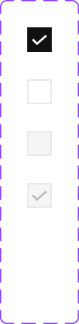

This documents describe checkbox component . The buttons is extended from **Checkbox** components from PrimeVue UI-Kit collection.
You can read more about it [here](https://primevue.org/checkbox/)



The CSS class was written in file **\_welfare-checkbox.scss**. The Vue component is **WelfareCheckbox**.
You can see detail more in file **CheckboxView**.

```html
<WelfareCheckbox v-model="checkboxOne" />
<WelfareCheckbox v-model="checkboxSecond" />
<WelfareCheckbox disabled />
<WelfareCheckbox disabled v-model="checkboxThird" />
```

#### Props

We extends [**Checkbox**](https://primevue.org/checkbox/) props (PrimeVue) (exclude: aria-labelledby,aria-label). Below, we add some additional props properties in **WelfareCheckbox** component.

| Name  | Type   | Description           |
| ----- | ------ | --------------------- |
| label | string | Label of the checbox. |

#### Emits

Defines valid emits in **WelfareCheckbox** component.

| Name              | Parameters       | ReturnType | Description                         |
| ----------------- | ---------------- | ---------- | ----------------------------------- |
| change            | event:Event      | void       | Callback to invoke on value change. |
| click             | event:MouseEvent | void       | Callback to invoke on value click.  |
| update:modelValue | value:any        | void       | Emitted when the value changes.     |
