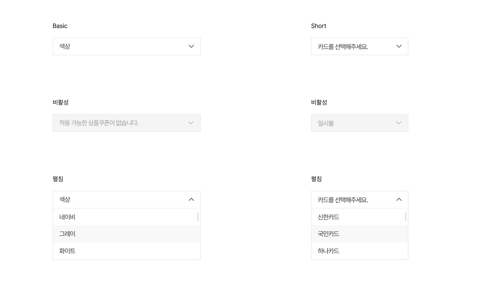

This documents describe select (Dropdown) component . The buttons is extended from **Dropdown** component from PrimeVue UI-Kit collection.
You can read more about it [here](https://primevue.org/dropdown/)



The CSS class was written in file **\_welfare-select.scss**. The Vue component is **WelfareSelect**.
You can see detail more in file **DropdownView**.

```html
<script setup lang="ts">
  const options: WelfareSelectOptionType[] = [
    { label: '하위분류 체계 정리 01', value: '1' },
    { label: '하위분류 체계 정리 02', value: '2' },
    { label: '하위분류 체계 정리 03', value: '3' }
  ]
</script>
<template>
  <WelfareSelect v-model="defaultSelect" placeholder="색상" class="wf_width-335" :options="options" />
  <WelfareSelect v-model="shortSelect" placeholder="카드를 선택해주세요." class="wf_width-220-important" :options="shortOptions" />
</template>
```

#### Props

We extends [**Dropdown**](https://primevue.org/dropdown/) props (PrimeVue) (exclude: aria-labelledby,aria-label). Below, we add some additional props properties in **WelfareSelect** component.

| Name       | Type | Description                 |
| ---------- | ---- | --------------------------- |
| modelValue | any  | Value of the component.     |
| class      | css  | The CSS class of the select |

#### Emits

Defines valid emits in **WelfareSelect** component.

| Name              | Parameters | ReturnType | Description                     |
| ----------------- | ---------- | ---------- | ------------------------------- |
| update:modelValue | value:any  | void       | Emitted when the value changes. |
