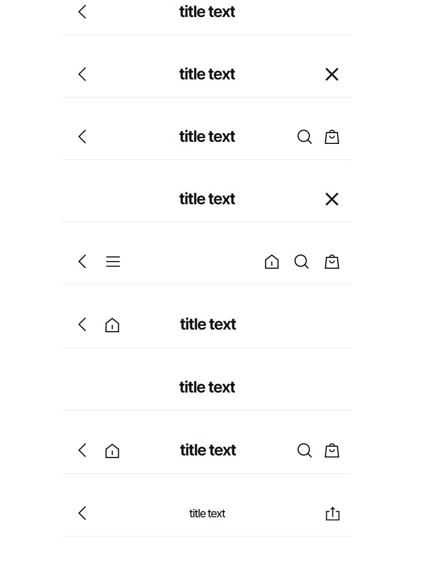
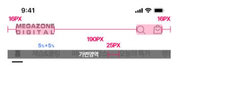
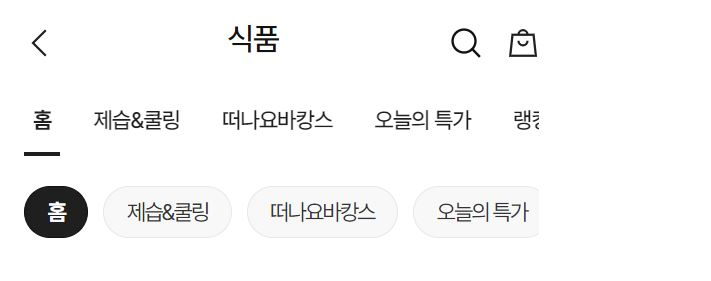
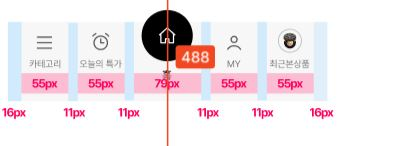

This documents describe navigation component.
**Table of Contents**

[TOC]

## Navigation



The Vue component is **WelfareTitleText**. You can see detail more in file **TitleView**.

```html
<WelfareTitleText title="title text" displayBackIcon />
<WelfareTitleText title="title text" displayBackIcon displayCloseIcon />
<WelfareTitleText title="title text" displayBackIcon displaySearchIcon displayCartIcon />
<WelfareTitleText title="title text" displayCloseIcon />
<WelfareTitleText displayBackIcon displayMenuIcon displayHomeRightIcon displaySearchIcon displayCartIcon />
<WelfareTitleText title="title text" displayBackIcon displayHomeLeftIcon />
<WelfareTitleText title="title text" />
<WelfareTitleText title="title text" displayBackIcon displayHomeLeftIcon displaySearchIcon displayCartIcon />
<WelfareTitleText title="title text" smallTitle displayBackIcon displayShareIcon />
```

#### Props

Defines valid emits in **WelfareTitleText** component.

| Name                 | Type    | Description                     |
| -------------------- | ------- | ------------------------------- |
| class                | string  | The css class style             |
| title                | string  | The title of page               |
| smallTitle           | string  | The small title of page         |
| displayBackIcon      | boolean | Mark display back icon or not   |
| displayMenuIcon      | boolean | Mark display menu icon or not   |
| displayHomeLeftIcon  | boolean | Mark home icon on the left      |
| displayHomeRightIcon | boolean | Mark home icon on the right     |
| displaySearchIcon    | boolean | Mark display search icon or not |
| displayCartIcon      | boolean | Mark display cart icon or not   |
| displayCloseIcon     | boolean | Mark display close icon or not  |
| displayShareIcon     | boolean | Mark display share icon or not  |
| hideBorder           | boolean | Mark hide border                |

#### Emits

Defines valid emits in **WelfareTitleText** component.

| Name                | Parameters | ReturnType | Description                              |
| ------------------- | ---------- | ---------- | ---------------------------------------- |
| on-click-back       |            | void       | Callback to back press event.            |
| on-click-menu       |            | void       | Callback to menu press event.            |
| on-click-home-left  |            | void       | Callback to home left icon press event.  |
| on-click-home-right |            | void       | Callback to home right icon press event. |
| on-click-search     |            | void       | Callback to search press event.          |
| on-click-cart       |            | void       | Callback to cart press event.            |
| on-click-close      |            | void       | Callback to close press event.           |
| on-click-share      |            | void       | Callback to share press event.           |

## Header Navigation



The CSS class was written in file **\_welfare-header.scss**.The Vue component is **WelfareHeaderNavigation**. You can see detail more in file **NavigationView**.

```html
<WelfareHeaderNavigation />
```

#### Props

Defines valid emits in **WelfareHeaderNavigation** component.

| Name   | Type    | Description                   |
| ------ | ------- | ----------------------------- |
| class  | string  | The css class style           |
| isDark | boolean | Mark navigation in dark style |

## Header Navigation with tab



The Vue component is **WelfareHeaderNavigation**. You can see detail more in file **NavigationView**.

```html
<div class="wf-px-16 wf_width-375 wf-navigation-header">
  <WelfareNavigationLayout :is-logo="false" :is-back="true" title="식품" />
  <div class="wf-mt-30">
    <WelfareTab :items="dataTab" type="line" :default="dataTab[0]" name="2" />
  </div>
  <div class="wf-mt-20">
    <WelfareTab :items="dataTab" type="round" :default="dataTab[0]" name="3" />
  </div>
</div>
```

## Bottom tab Navigation



The CSS class was written in file **\_welfare-navigation.scss**. The Vue component is **WelfareHeaderNavigation**. You can see detail more in file **NavigationView**.

```html
<div class="wf-px-16 wf_width-375 wf-navigation-header">
  <WelfareNavigation :is-logo="false" :is-back="true" title="식품" />
</div>
```
