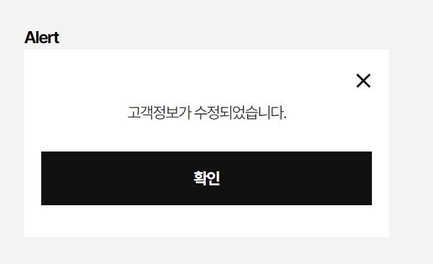
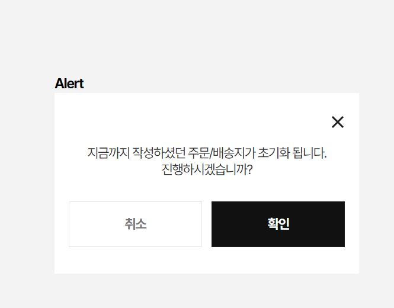

This documents describe popup component. We built ***useModal*** or ***useModalBottomSheet*** to quickly open popup with dynamic content and actions. 
**Table of Contents**

[TOC]

## Popup Notification



The Vue component is **PopupNotification**.You can see detail more in file **PopupView**.

```html
<PopupNotification content="고객정보가 수정되었습니다." />
```

#### Props

Defines valid props in **PopupNotification** component.

| Name        | Type                  | Description                                                  |
| ----------- | --------------------- | ------------------------------------------------------------ |
| content     | string                | the message content of popup                                 |
| type        | 'default' , 'warning' | The type of popup.                                           |
| buttonLabel | string                | The button text                                              |
| onAccept    | Function              | The function called when user press to button or close modal |

## Popup Confirmation



The Vue component is **PopupConfirmText**.You can see detail more in file **PopupView**.

```html
<PopupConfirmText content="고객정보가 수정되었습니다." />
```

#### Props

Defines valid props in **PopupNotification** component.

| Name               | Type                  | Description                                                         |
| ------------------ | --------------------- | ------------------------------------------------------------------- |
| content            | string                | the message content of popup                                        |
| type               | 'default' , 'warning' | The type of popup.                                                  |
| buttonCancelLabel  | string                | The button cancel text                                              |
| buttonConfirmLabel | string                | The button accept text                                              |
| onCancel           | Function              | The function called when user press to cancel button or close modal |
| onConfirm          | Function              | The function called when user press to accept butto                 |
