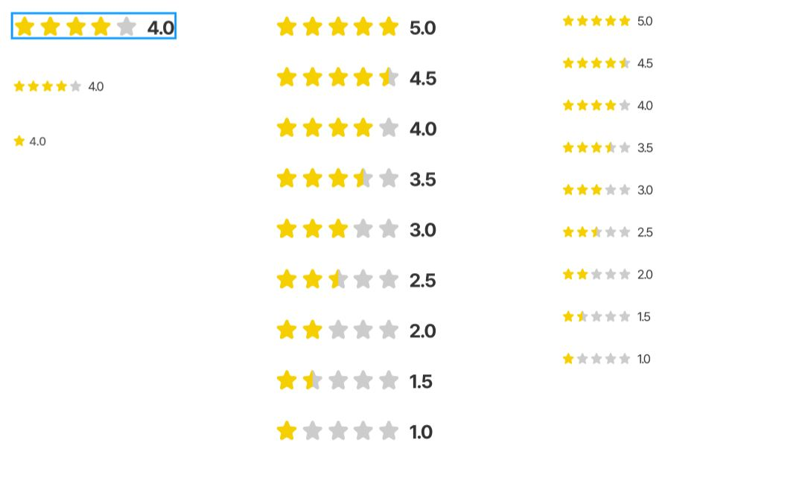

This documents describe score styles.



The Vue component is **WelfareScore**. You can see detail more in file **ScoreView**.

```html
<WelfareScore :value="4" />
<WelfareScore :value="4" small />
<WelfareScore :value="4" small :number="1" />
```

#### Props

Defines valid properties in **WelfareScore** component.

| Name       | Type    | Description             |
| ---------- | ------- | ----------------------- |
| value      | number  | The value of score      |
| number     | number  | Number star show        |
| boldText   | boolean | Mark text bold or not   |
| centerText | boolean | Mark text center or not |
