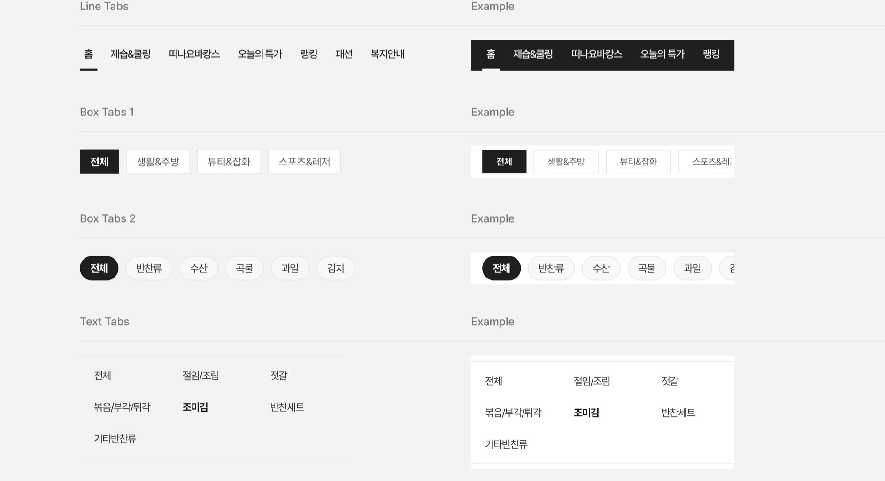

The CSS class was written in file **\_welfare-tabs.scss**.

The Vue component is **WelfareTab**. You can see detail more in file **TabView**.



```html
<WelfareTab :items="listLineTab" @onChange="updateView" :default="listLineTab[0]" name="line-tab-1" />
<div class="wf_width-375 wf-bg-primary wf-px-16 wf-pt-4 wf-pb-2">
  <WelfareTab :items="listLineTab" @onChange="updateView" :default="listLineTab[0]" name="line-tab-2" type="line-white" />
</div>
```

#### Props

Defines valid props in **WelfareTab** component.

| Name           | Type                                                           | Description                          |
| -------------- | -------------------------------------------------------------- | ------------------------------------ |
| type           | 'box' , 'box-small' , 'line' , 'round' , 'text' , 'line-white' | The type style of tab                |
| name           | string                                                         | The name of item                     |
| items          | WelfareTabDataType[]                                           | The list of tab items                |
| default        | WelfareTabDataType                                             | The default active of tab            |
| class          | string                                                         | The css class style of tab container |
| classWrapSpace | string                                                         | The css class style of tab box       |

#### Emits

Defines valid emits in **WelfareTab** component.

| Name      | Parameters               | ReturnType | Description                                       |
| --------- | ------------------------ | ---------- | ------------------------------------------------- |
| on-change | event:WelfareTabDataType | void       | Callback to invoke when an active tab is changed. |
