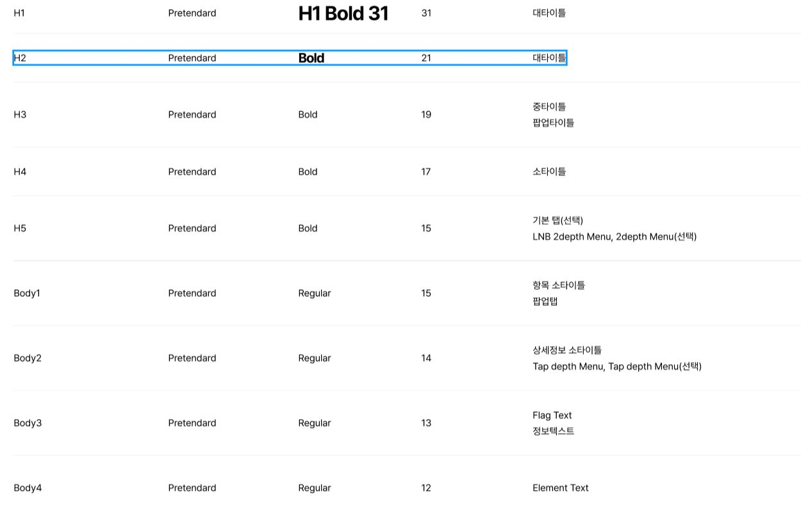

This documents describe head title, sub-title and body text styles.

**Table of Contents**

[TOC]

## Fonts

The scss class was written in file **\_welfare-typography.scss**.

```css
/* Typo */

@font-face {
  font-family: 'Pretendard';
  font-weight: 300;
  src: url('/src/assets/fonts/Pretendard-Light.woff') format('woff');
  src: url('/src/assets/fonts/Pretendard-Light.woff2') format('woff2');
  font-display: swap;
}

@font-face {
  font-family: 'Pretendard';
  font-weight: 400;
  src: url('/src/assets/fonts/Pretendard-Regular.woff') format('woff');
  src: url('/src/assets/fonts/Pretendard-Regular.woff2') format('woff2');
  font-display: swap;
}

@font-face {
  font-family: 'Pretendard';
  font-weight: 500;
  src: url('/src/assets/fonts/Pretendard-Medium.woff') format('woff');
  src: url('/src/assets/fonts/Pretendard-Medium.woff2') format('woff2');
  font-display: swap;
}

@font-face {
  font-family: 'Pretendard';
  font-weight: 600;
  src: url('/src/assets/fonts/Pretendard-SemiBold.woff') format('woff');
  src: url('/src/assets/fonts/Pretendard-SemiBold.woff2') format('woff2');
  font-display: swap;
}

@font-face {
  font-family: 'Pretendard';
  font-weight: 700;
  src: url('/src/assets/fonts/Pretendard-Bold.woff') format('woff');
  src: url('/src/assets/fonts/Pretendard-Bold.woff2') format('woff2');
  font-display: swap;
}
```

## Text styles

The scss class was written in file **\_welfare-font.scss**.



```css
// font-size: 36
.wf-font_36--semi {
  font-size: $font-36;
  font-style: normal;
  font-weight: $wei-600;
  line-height: 100%;
  letter-spacing: -1px;
  font-feature-settings:
    'clig' off,
    'liga' off;
}

// font-size: 31
.wf-font_31--bold {
  font-size: $font-31;
  font-style: normal;
  font-weight: $wei-700;
  line-height: 100%;
  letter-spacing: -1px;
  font-feature-settings:
    'clig' off,
    'liga' off;
}

// font-size: 24
.wf-font_24--bold {
  font-size: $font-24;
  font-style: normal;
  font-weight: $wei-700;
  font-feature-settings:
    'clig' off,
    'liga' off;
  line-height: 100%;
  letter-spacing: -1px;
}

// font-size: 23
.wf-font_23--bold {
  font-size: $font-23;
  font-style: normal;
  font-weight: $wei-700;
  font-feature-settings:
    'clig' off,
    'liga' off;
  line-height: 100%;
  letter-spacing: -1px;
}

// font-size: 22
.wf-font_22--bold {
  font-size: 22px;
  font-style: normal;
  font-weight: $wei-700;
  font-feature-settings:
    'clig' off,
    'liga' off;
  line-height: 100%;
}

// font-size: 21
.wf-font_21--bold {
  font-size: $font-21;
  font-style: normal;
  font-weight: $wei-700;
  font-feature-settings:
    'clig' off,
    'liga' off;
  line-height: 100%;
  letter-spacing: -1px;
}
```
