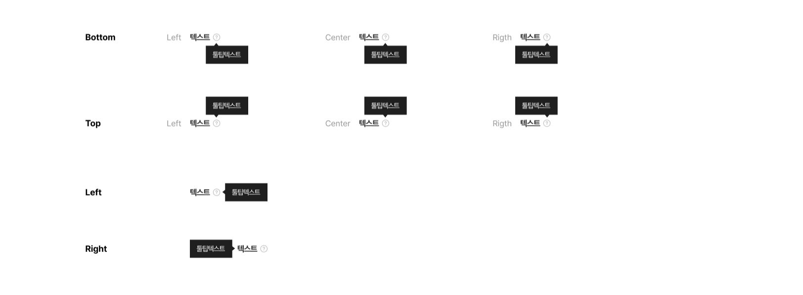

This documents describe tooltip styles.



The CSS class was written in file **\_welfare-tooltip.scss**. The Vue component is **WelfareTooltip**.
You can see detail more in file **TooltipView**.

```html
<WelfareTooltip text="툴팁텍스트" :type="'bottom'" :position="'left'" visible />
<WelfareTooltip text="툴팁텍스트" :type="'bottom'" visible />
<WelfareTooltip text="툴팁텍스트" :type="'bottom'" :position="'right'" visible />
```

#### Props

Defines valid properties in **WelfareButtonTap** component.

| Name     | Type                               | Description                     |
| -------- | ---------------------------------- | ------------------------------- |
| text     | string                             | Text of the tooltip.            |
| visible  | boolean                            | Mark tooltip visible or not     |
| type     | 'top' ,'bottom' , 'left' , 'right' | The position visible of tooltip |
| position | 'center' , 'left' , 'right'        | The position of text            |
