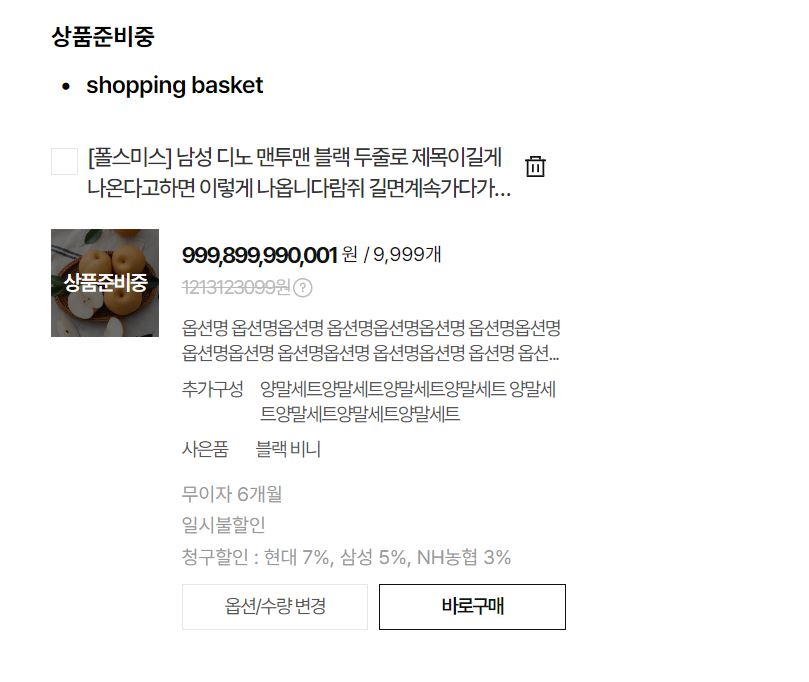

This documents describe some product item(unit) component.
**Table of Contents**

[TOC]

## Unit - My page/Claim (WelfareUnitCardStateDelivery)


The Vue component is **WelfareUnitCardStateDelivery**.This component extends from **WelfareUnitCard** component. You can see detail more in file **UnitView**.

```html
<WelfareUnitCardStateDelivery />
```

#### Props

Defines valid properties in **WelfareUnitCardStateDelivery** component.

| Name                  | Type         | Description                         |
| --------------------- | ------------ | ----------------------------------- |
| isCheckBox            | boolean      | Mark show checkbox of item          |
| isShowMoney           | boolean      | Mark show price of item             |
| isShowDelete          | boolean      | Mark show delete option             |
| isOutOfStock          | boolean      | Mark show item out of stock         |
| checked               | boolean      | Mark state of checkbox              |
| isButtonStateDelivery | boolean      | Mark show button delivery           |
| isDeliveryPage        | boolean      | Mark page is using in delivery page |
| product               | ProductModel | Product data                        |
| isButtonOption        | boolean      | Mark show two button at the bottom  |

#### Emits

Defines valid emits in **WelfareUnitCardStateDelivery** component.

| Name           | Parameters    | ReturnType | Description                         |
| -------------- | ------------- | ---------- | ----------------------------------- |
| update:checked | value:boolean | void       | Emitted when checked changed value. |

## Unit - My page/Customer (WelfareUnitCardStateCustomer)


The Vue component is **WelfareUnitCardStateCustomer**. This component extends from **WelfareUnitCard** component. You can see detail more in file **UnitView**.

```html
<WelfareUnitCardStateCustomer :product="$props.product" />
```

#### Props

Defines valid properties in **WelfareUnitCardStateCustomer** component.

| Name           | Type         | Description                         |
| -------------- | ------------ | ----------------------------------- |
| isCheckBox     | boolean      | Mark show checkbox of item          |
| isShowMoney    | boolean      | Mark show price of item             |
| isShowDelete   | boolean      | Mark show delete option             |
| isOutOfStock   | boolean      | Mark show item out of stock         |
| isDeliveryPage | boolean      | Mark page is using in delivery page |
| product        | ProductModel | Product data                        |
| checked        | boolean      | Mark state of checkbox              |

#### Emits

Defines valid emits in **WelfareUnitCardStateDelivery** component.

| Name           | Parameters    | ReturnType | Description                         |
| -------------- | ------------- | ---------- | ----------------------------------- |
| update:checked | value:boolean | void       | Emitted when checked changed value. |

## Unit - My page/Order (WelfareUnitCardOrder)


The Vue component is **WelfareUnitCardOrder**. This component extends from **WelfareUnitCard** component. You can see detail more in file **UnitView**.

```html
<WelfareUnitCardOrder :product="$props.product" />
```

#### Props

Defines valid properties in **WelfareUnitCardOrder ** component.

| Name           | Type         | Description                         |
| -------------- | ------------ | ----------------------------------- |
| isCheckBox     | boolean      | Mark show checkbox of item          |
| isShowMoney    | boolean      | Mark show price of item             |
| isShowDelete   | boolean      | Mark show delete option             |
| isOutOfStock   | boolean      | Mark show item out of stock         |
| isDeliveryPage | boolean      | Mark page is using in delivery page |
| product        | ProductModel | Product data                        |
| checked        | boolean      | Mark state of checkbox              |
| quantity       | any          | Number of item want to order        |

#### Emits

Defines valid emits in **WelfareUnitCardOrder** component.

| Name            | Parameters | ReturnType | Description                    |
| --------------- | ---------- | ---------- | ------------------------------ |
| update:quantity | value:any  | void       | Emitted when checked quantity. |

## Unit - Shopping (WelfareUnitCardShopping)



The Vue component is **WelfareUnitCardShopping**. This component extends from **WelfareUnitCard** component. You can see detail more in file **UnitView**.

```html
<WelfareUnitCardShopping :product="$props.product" />
```

#### Props

Defines valid properties in **WelfareUnitCardShopping** component.

| Name                  | Type         | Description                         |
| --------------------- | ------------ | ----------------------------------- |
| isButtonStateDelivery | boolean      | Mark show button delivery           |
| isCheckBox            | boolean      | Mark show checkbox of item          |
| isShowMoney           | boolean      | Mark show price of item             |
| isShowDelete          | boolean      | Mark show delete option             |
| isOutOfStock          | boolean      | Mark show item out of stock         |
| isDeliveryPage        | boolean      | Mark page is using in delivery page |
| product               | ProductModel | Product data                        |
| checked               | boolean      | Mark state of checkbox              |
| quantity              | any          | Number of item want to order        |
| isButtonOption        | boolean      | Mark show two button at the bottom  |

#### Emits

Defines valid emits in **WelfareUnitCardShopping** component.

| Name           | Parameters    | ReturnType | Description                         |
| -------------- | ------------- | ---------- | ----------------------------------- |
| update:checked | value:boolean | void       | Emitted when checked changed value. |

## Unit - product item (WelfareProductItem)


The Vue component is **WelfareProductItem**. You can see detail more in file **UnitSecondView**.

```html
<WelfareProductItem is-heart is-buy :data="productLg" />
```

#### Props

Defines valid properties in **WelfareUnitCardShopping** component.

| Name     | Type                    | Description                |
| -------- | ----------------------- | -------------------------- |
| data     | WelfareUnitProductModel | Product data               |
| isBuy    | boolean                 | Mark product can buy       |
| isCart   | boolean                 | Mark show shopping cart    |
| isHeart  | boolean                 | Mark show favorited button |
| isCoupon | boolean                 | Mark show coupon           |
| isPrice  | boolean                 | Mark show price            |
| type     | 'ssm', 'sm','md','lg'   | The size type of item      |
| isSale   | boolean                 | Mark item is sale          |

## Unit - product item small (WelfareProductItemSmall)


The Vue component is **WelfareProductItemSmall**. You can see detail more in file **UnitSecondView**.

```html
<WelfareProductItemSmall
  :data="{
              percent: 99,
              thumbnailProduct: ProductItemImage
            }"
/>
```

#### Props

Defines valid properties in **WelfareUnitCardShopping** component.

| Name   | Type                    | Description            |
| ------ | ----------------------- | ---------------------- |
| data   | WelfareUnitProductModel | Product data           |
| isDark | boolean                 | Mark enable dark style |

## Unit - product item list (WelfareProductItemVertical)


The Vue component is **WelfareProductItemVertical**. You can see detail more in file **UnitListView**.

```html
<WelfareProductItemVertical :data="productMd" />
```

#### Props

Defines valid properties in **WelfareProductItemVertical** component.

| Name     | Type                    | Description                |
| -------- | ----------------------- | -------------------------- |
| data     | WelfareUnitProductModel | Product data               |
| isBuy    | boolean                 | Mark product can buy       |
| isCart   | boolean                 | Mark show shopping cart    |
| isHeart  | boolean                 | Mark show favorited button |
| isCoupon | boolean                 | Mark show coupon           |
| isPrice  | boolean                 | Mark show price            |
| type     | 'ssm', 'sm','md','lg'   | The size type of item      |
| isSale   | boolean                 | Mark item is sale          |

## Unit Card (WelfareUnitCard)


The Vue component is **WelfareUnitCard**

```html
<<WelfareUnitCard :product="$props.product" />
```

#### Props

Defines valid properties in **WelfareUnitCard** component.

| Name           | Type         | Description                         |
| -------------- | ------------ | ----------------------------------- |
| isCheckBox     | boolean      | Mark show checkbox of item          |
| isShowMoney    | boolean      | Mark show price of item             |
| isShowDelete   | boolean      | Mark show delete option             |
| isOutOfStock   | boolean      | Mark show item out of stock         |
| isDeliveryPage | boolean      | Mark page is using in delivery page |
| product        | ProductModel | Product data                        |
| checked        | boolean      | Mark state of checkbox              |

#### Emits

Defines valid emits in **WelfareUnitCard** component.

| Name           | Parameters    | ReturnType | Description                         |
| -------------- | ------------- | ---------- | ----------------------------------- |
| update:checked | value:boolean | void       | Emitted when checked changed value. |
